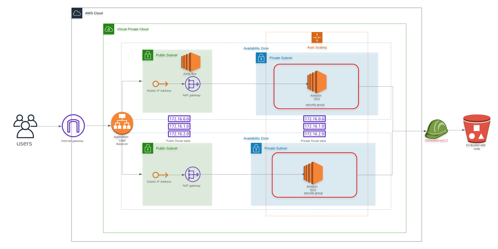

## `Udagram Website Infra`

### Scalable web infrastructure on AWS

### Architecture Diagram

### Deployed Url

http://udagr-webap-1o3pg299xdjg2-1284940743.us-west-2.elb.amazonaws.com/

### Deployment instructions

1) `./create.sh udagraminfra network.yml network-params.json` 
     - For setting up VPC's, Subnets, NAT Gateway, Internet Gateway, Route table.

2) `./create.sh udagrambastion bastion.yml bastion-params.json` 
     - For setting up Bastion Server

3) `./create.sh udagramserver server.yml server-params.json` 
     - For setting up server related components such as EC2, Load balancers, Security and target Groups, Auto-Scaling Group